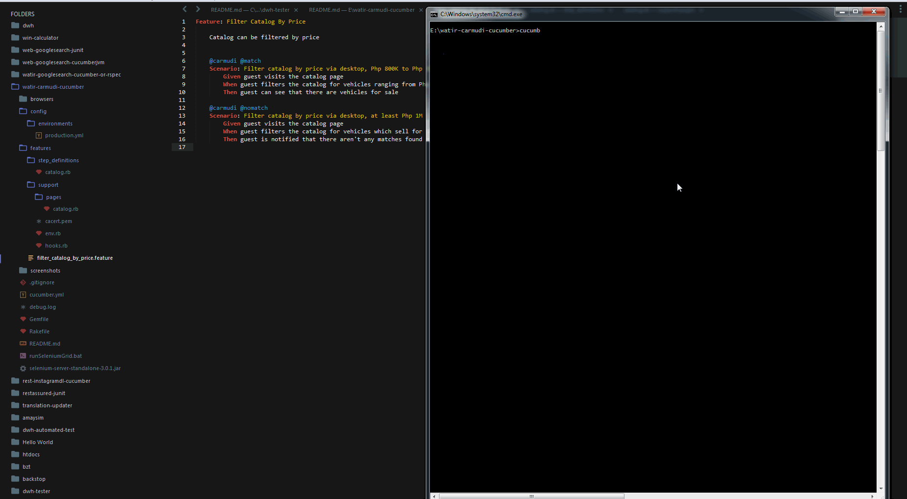

Watir-Carmudi-Cucumber
======================

Watir-Carmudi-Cucumber is a sample test suite running via the browser for checking running business rules and user flows for the `Carmudi` web app, built as a technical exercise. The test suite runs in `Ruby`, integrated to a number of gems, namely `Cucumber`, `Watir`, `Page-Object`, `Webdriver-User-Agent`, among others.

## Setup

1. Install Ruby and the Ruby Development Kit
2. Clone or download this repository
3. Open a terminal / command line of your choice and navigate to your local repository
4. Run `gem install bundler` to install the bundler gem
5. Run `bundle install` to install gem dependencies
6. Have a Google Chrome browser installed in your machine

## Running Sample Tests

To run the sample test suite:
`cucumber [desired_tags] [MOBILE=true/false]`

For example:

* `cucumber` to run all tests via desktop
* `cucumber MOBILE=true` to run all tests via mobile

Existing Tags in the test suite:

* `-t @match` to test filter catalog by price where search results > 0
* `-t @nomatch` to test filter catalog by price where there aren't any matches found

Author: **Jason B. Ogayon (Software Tester)**