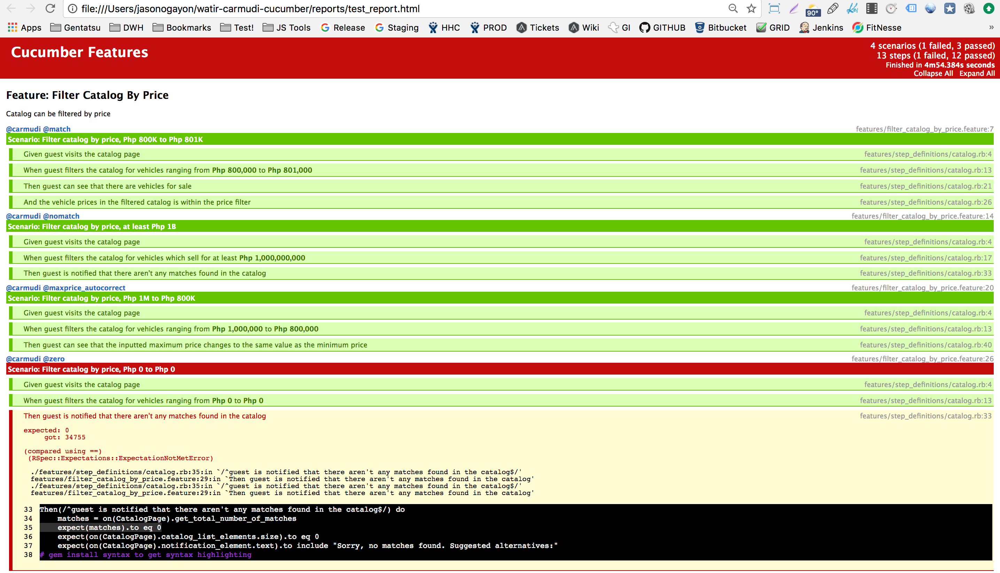

Watir-Carmudi-Cucumber
======================

Watir-Carmudi-Cucumber is a sample test suite running via a browser for checking running business rules and user flows for the `Carmudi` web app's filter-by-price feature, built as a technical exercise. The test suite runs in `Ruby`, integrated to a number of gems, namely `Cucumber` for writing tests in Gherkin format, `Watir` for automating the browser, `Page-Object` for managing page elements, `Webdriver-User-Agent` for simulating mobile browsers, among others.

Note: Screenshots above shows tests running on Firefox 54.0.1 on a macOS Sierra 10.12.4 machine, with slow Globe data connectivity.

## Setup

1. Install Ruby and the Ruby Development Kit
2. Clone or download this repository
3. Open a terminal / command line of your choice and navigate to your local repository
4. Run `gem install bundler` to install the bundler gem
5. Run `bundle install` to install gem dependencies
6. Have a Mozilla Firefox or Google Chrome browser installed in your machine

## Running Sample Tests

To run the sample test suite:
`cucumber [desired_tags] [MOBILE=true/false] [WINDOWS=true/false]`

For example:

* `cucumber` to run all tests via desktop (requires a MAC machine and a FIREFOX browser by default)
* `cucumber MOBILE=true` to run all tests in mobile
* `cucumber WINDOWS=true` to run tests on a Windows machine
* `cucumber BROWSER=chrome` to run tests on Google Chrome

Existing Tags in the test suite:

* `-t @match` to test filter catalog by price where search results > 0
* `-t @nomatch` to test filter catalog by price where there aren't any matches found
* `-t @maxprice_autocorrect` to test max price behavior when inputted max price is less than given min price

## Test Reporting

Each run of the test suite automatically generates a HTML test report, found inside the `reports` directory with a file name of test_report.html. To modify the file name and location where a test report is saved, one can either modify the settings in the cucumber.yml file or manually set the file name and location at runtime.

A screenshot of a test report (click to view actual sample report):

## Maintenance

Browser vendors (Google, Mozilla) update their browser drivers from time to time  and as such we need to update these drivers frequently. The browser drivers in this test suite can be found inside the `browsers` directory.

It is also good practice to update the dependencies we use for testing. Make sure you run `bundle update` regularly, although we may have to deal with problems because of such updates. It is not uncommon to have browsers fail to run test scripts because we updated our dependencies.

Author: **Jason B. Ogayon (Software Tester)**